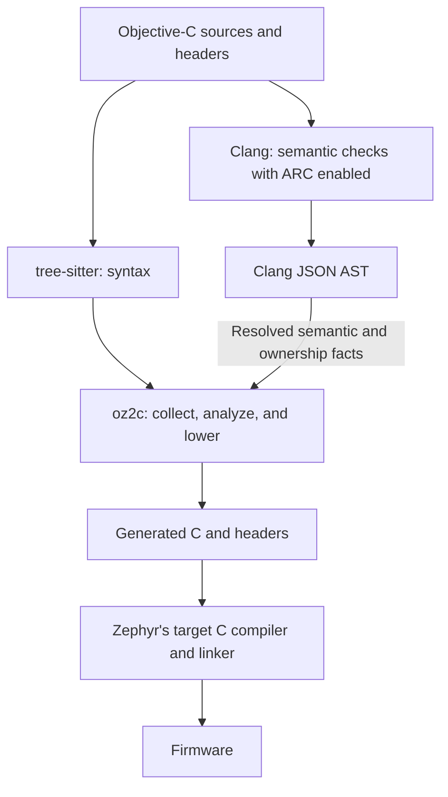

# Objective-Z

**Objective-Z brings a statically compiled subset of Objective-C to Zephyr firmware.**
Its `oz2c` transpiler lowers `.m` sources to readable, auditable C, using
tree-sitter for syntax and Clang for Objective-C semantic checks and ownership information.
The generated code builds with Zephyr's existing C toolchain, without a conventional
Objective-C runtime.

Classes and protocols organize firmware alongside direct calls to C and Zephyr APIs.
Object allocation uses fixed-capacity, per-class `k_mem_slab` pools by default, and
`oz2c` implements constrained Automatic Reference Counting (ARC) in generated C.
Known receivers use direct C calls; protocol sends that need runtime selection use
generated dispatch tables. Allocation, reference counting, and dispatch support still
run on the device — the aim is to remove machinery where static knowledge permits it,
not to claim that every abstraction has no runtime cost.

## What the compiler removes — and what remains

Higher-level syntax does not require general-purpose message lookup. For example:

| Objective-Z source | Lowering |
|---|---|
| `[hello greet]`, where `hello` is a `MyFirstObject *` | A direct C call: `MyFirstObject_greet(hello)` |
| `[x toggle]`, where `x` is an `id<Switchable>` with no statically known concrete class | A generated protocol dispatcher selecting an implementation by class ID from a fixed `const` table |
| `[Foo new]`, using the inherited allocation method | Allocation from Foo's per-class `k_mem_slab`, followed by initialization |

The first example comes from [hello_world](samples/hello_world/src/main.m).
The table shows the call shapes, not complete generated functions: receiver casts,
nil-receiver guards, and ownership cleanup are omitted.

**Static knowledge removes dispatch machinery where possible. Where runtime selection
is needed, Objective-Z generates explicit, bounded support.** Protocol dispatch still
selects an implementation at runtime; slab allocation and reference counting still
execute on the device. Fixed tables and pools replace open-ended runtime registries
and default heap allocation, not all runtime work.

## Design goals

Objective-Z is packaged as a Zephyr module. Its design focuses on:

- **Direct C and Zephyr interoperability** — use C functions, kernel APIs, devicetree
  accessors, and C macros from Objective-C source without a separate binding layer.
- **Useful object-oriented structure** — classes, protocols, categories, and properties
  provide ways to organize firmware within an explicitly supported language subset.
- **Predictable resource usage** — default to fixed-capacity object pools rather than
  a general-purpose heap. Pool capacity is an application resource budget, not a proof
  that every allocation will succeed.
- **Static-first lowering** — resolve calls at build time where possible and generate
  fixed tables where runtime selection is needed. The class and selector set is known
  at transpile time; there is no runtime class registration or method swizzling.
- **Inspectable output and existing tools** — emit ordinary C that developers can
  inspect, compile, and link with Zephyr's existing toolchain. Clang participates in
  source analysis; it does not replace the target C compiler.
- **Explicit semantic boundaries** — reject unsupported constructs with located
  diagnostics rather than silently approximating their semantics.
  The [dialect ledger](docs/OBJECTIVE_C_DIALECT.md) and
  [ARC conformance ledger](docs/ARC.md) document supported behavior and known gaps.

## Architecture



### Transpiler pipeline

The two frontends serve different purposes:

- **tree-sitter** is the primary syntax frontend. `oz2c` collects classes, methods,
  protocols, and source spans from its concrete syntax tree (CST).
- **Clang**, run with `-fobjc-arc`, checks Objective-C semantics and produces a JSON
  AST containing resolved types, ownership qualifiers, and ARC transfer information.
  `oz2c` uses resolved facts such as ivar ownership and method definedness.
- **`oz2c`** implements constrained ARC in ordinary C. Its source-level analysis
  determines ownership provenance, follows supported aliases and escapes, handles
  return and initializer ownership, and emits or elides retain/release operations.
  Clang does not generate this C or optimize its reference-counting calls.

**Reading Clang's ARC transfer marks is not the same as lowering them.**
`oz2c --check-arc` uses those marks and ownership qualifiers to audit its own analysis;
they do not directly drive retain/release emission. The audit reports findings,
not a pass/fail conformance gate. See the [hybrid ARC model](docs/STATUS.md#the-hybrid-model-what-this-backends-arc-is)
and the [ARC conformance contract](docs/ARC.md) for the precise boundary and evidence.

The emitter substitutes source text in place rather than regenerating it from
Clang's AST. This preserves unexpanded C macros and produces one `.h`/`.c` pair
per origin file plus shared companion code.

The Zephyr build supplies one Clang AST dump per source. The `oz2c` CLI requires
`--ast` for a source declaring a class; a missing dump is a located error.
`--manifest-only` is exempt because it only discovers the configure-time file list.
The explicit `--allow-missing-ast` escape hatch uses narrower ownership rules and
can leak `id`-typed ivars; it is not the normal build path.

## Supported features

- Classes, single inheritance, protocols, categories, and synthesized properties.
- Constrained ARC with cleanup for supported scopes and ownership transfers.
- Non-capturing blocks lowered to C functions.
- Boxed values, collection literals, subscripting, lightweight generics, and fast enumeration.
- Zephyr integration through C APIs, devicetree, zbus, and kernel primitives.
- Fixed-set introspection and reflection, configurable through Kconfig.
- Foundation classes for strings, collections, and fixed-point numbers.
- Source-level debugging through generated `#line` directives and clangd support.

These are summaries, not full Objective-C compatibility claims. The
[dialect ledger](docs/OBJECTIVE_C_DIALECT.md) records the supported forms and
restrictions. The [user guide](docs/USER_GUIDE.md#foundation-and-generated-code)
lists Foundation APIs and explains generated output.

## Resource model

Ordinary allocation uses per-class `k_mem_slab` pools with build-time capacity.
Defaults come from allocation-site analysis, with limited call-site adjustments
for escaping results. **This is not a proof of maximum simultaneous live objects.**
Repeated calls, retained results, concurrency, and callers outside the analyzed
source may require explicit capacities.

Use source directives such as `/* oz-pool: Sensor=8 */`, CMake `POOL_SIZES`,
or CLI `--pool-sizes` to set class budgets. Collections use a separate item pool
and require `CONFIG_SYS_MEM_BLOCKS=y`; item-buffer capacity and contiguous free
space must also cover the workload.

Slab allocation is non-blocking (`K_NO_WAIT`): a full pool makes `+alloc` return
`nil`, not grow or fall back to the heap. Handle failure before initialization
or use; do not assume every factory propagates it safely. Heap allocation is a
separate, explicit path enabled by `CONFIG_OBJZ_HEAP`, which defaults to `n`.

See the [complete resource model](docs/USER_GUIDE.md#resource-model) for sizing
assumptions, override precedence, item pools, and exhaustion diagnostics.
Fixed object storage does not prove that the entire application is heap-free,
that every allocation succeeds, or that execution meets a timing deadline.

## Limitations

Objective-Z is a supported subset, not a conventional Objective-C environment:

- Exceptions, autorelease pools, manual memory-management sends, and zeroing weak
  references are refused.
- Blocks cannot capture stack locals. Runtime class registration, method swizzling,
  and general message forwarding are not supported.
- Objective-C inside a `#define` body is refused; supported Objective-C expressions
  in macro arguments can be lowered while preserving the invocation.
- Variadic Objective-C methods are refused; variadic plain C functions remain supported.
- `__bridge` transfers no ownership. A C callback's stored pointer does not keep
  an object alive. `__bridge_retained` and `__bridge_transfer` are refused.
- `__unsafe_unretained` is non-owning and is not cleared when its object dies.
- `OZFN`/`OZM` block contents bypass Clang's type checks; declare return types
  explicitly. Signature errors can surface in generated C instead (#603).

The policy is to refuse unsupported semantics with located diagnostics, not silently
approximate them. The [dialect ledger](docs/OBJECTIVE_C_DIALECT.md) and
[ARC ledger](docs/ARC.md) distinguish implemented behavior, delegated checks,
refusals, known gaps, and unexamined rules. A successful transpile or green test
suite is not a proof of memory safety for arbitrary source.

See [the user guide](docs/USER_GUIDE.md#language-boundaries) for additional boundaries
and [verification limits](docs/STATUS.md#what-is-not-verified) for what has not been
tested. Full peak-liveness pool analysis is not a current capability; design
directions and tracked gaps are not delivery commitments.

## Quick start

Install the [host prerequisites](docs/USER_GUIDE.md#prerequisites): a Zephyr-ready
Python environment with west, a host C compiler, and Rust/Cargo. The tested
versions are **Zephyr v4.4.2**, **SDK 1.0.1**, and the SDK's **Clang 19**.

Create a new west workspace; the manifest fetches Zephyr and its required modules:

```sh
west init -m https://github.com/rodrigopex/objective-z --mr main objective-z-workspace
cd objective-z-workspace
west update
west zephyr-export
python -m pip install -r zephyr/scripts/requirements.txt

# Install the tested SDK with its opt-in LLVM component, if not already installed
west sdk install --llvm --version 1.0.1 -b ~/.local

cd objective-z
west build -p always -b mps2/an385 samples/hello_world
west build -t run
```

The default sample is `hello_world`, built and run on `mps2/an385` in QEMU.
Among the boot messages, expect:

```text
Hello, world from class
Hello, world from object
```

For an existing west workspace, follow the
[integration guide](docs/USER_GUIDE.md#using-in-your-project) instead of initializing
another workspace. To choose another sample, give its directory to west:

```sh
west build -p always -b mps2/an385 samples/arc_demo
west build -t run
```

Browse the [sample catalog](docs/USER_GUIDE.md#samples) for other features.

## Projects exercising Objective-Z

These projects exercise different parts of the design beyond the compiler samples.
The evidence below is tied to inspected revisions, not a claim that their latest
versions have been tested with every Objective-Z release.

### px-keyboard — embedded application integration

[px-keyboard](https://github.com/rodrigopex/px-keyboard) is Bluetooth LE HID firmware
for Nordic development boards. Its Objective-C sources combine Zephyr Bluetooth
callbacks, zbus channels, timers, input handling, and GPIO/PWM output. Protocols
separate indicator capabilities from their concrete drivers; C APIs remain directly
available inside the methods.

At revision [`06734d2`](https://github.com/rodrigopex/px-keyboard/tree/06734d2bd7eff45cd4b92d7697b71479219e1876),
the [application record](https://github.com/rodrigopex/px-keyboard/blob/06734d2bd7eff45cd4b92d7697b71479219e1876/README.md)
reports nRF54L05 DK hardware pairing, host switching, and HID input observations,
and distinguishes default firmware from a separate pairing trial. It also identifies
unverified failure paths and configuration-specific nRF52833 runtime behavior.
This is evidence of real integration, not exhaustive device or Bluetooth validation.

### px-app — multi-file language and Zephyr integration

[px-app](https://github.com/rodrigopex/px-app) is a sensor-monitoring integration
exercise. Its [application source](https://github.com/rodrigopex/px-app/blob/bc36379946a63e22a0f065e160c6d1953f796dc3/src/main.m)
combines protocol-typed collections, fast enumeration, a filter pipeline, deep
inheritance, and a zbus publisher across multiple files.

The [`bc36379` revision record](https://github.com/rodrigopex/px-app/commit/bc36379946a63e22a0f065e160c6d1953f796dc3)
reports a build and execution to completion on `mps2/an385` in QEMU.
Its [changelog](https://github.com/rodrigopex/px-app/blob/bc36379946a63e22a0f065e160c6d1953f796dc3/CHANGELOG.md)
also records earlier nRF52833 hardware checkpoints; those are historical results,
not fresh hardware validation of this revision or the current transpiler.

### oz2c-challenges — compiler boundaries and diagnostics

[oz2c-challenges](https://codeberg.org/oz2c/oz2c-challenges) builds one Objective-C
mutation at a time to probe malformed input, language boundaries, and diagnostic
quality. Its [runner at revision `7968bac`](https://codeberg.org/oz2c/oz2c-challenges/src/commit/7968bac364e5cc61ea7e516e1ed0f43aeacb0134/run-mutation.sh)
distinguishes located and unlocated transpiler refusals, Clang errors, generated-C
failures, acceptance, hangs, and crashes. It records both the challenge and
Objective-Z revisions for each run and checks results against expected outcomes.

The [expectation metadata](https://codeberg.org/oz2c/oz2c-challenges/src/commit/7968bac364e5cc61ea7e516e1ed0f43aeacb0134/mutation-expectations.json)
pins its last verified sweep to an earlier Objective-Z revision.
`MUTATIONS.md` is a historical research record, not a current pass count.
These are build-stage diagnostic probes, not firmware execution or hardware tests.

## Documentation

| Document | Use it for |
|---|---|
| [User guide](docs/USER_GUIDE.md) | Prerequisites, project integration, configuration, pools, commands, samples |
| [Practical ARC guide](docs/ARC_GUIDE.md) | Owning slots, cleanup, initialization, cycles, and C callback lifetimes |
| [Objective-C dialect](docs/OBJECTIVE_C_DIALECT.md) | Per-construct support verdicts and evidence |
| [ARC conformance](docs/ARC.md) | Normative ownership rules and verification limits |
| [Status and design records](docs/STATUS.md) | Analysis architecture, recorded results, and reasons behind decisions |
| [Benchmarks](docs/BENCHMARKS.md) | Reproduction commands and clearly labeled historical measurements |
| [Test infrastructure](tests/README.md) | Host corpora, sanitizer options, and Zephyr integration tests |
| [Working practices](docs/WORKING.md) | Concurrent changes, validation pitfalls, and version policy |

## Testing

The primary gate is:

```sh
cargo test --manifest-path tools/oz2c/Cargo.toml
```

Build `oz2c` before running Twister so parallel sample configurations do not each
start a Cargo build:

```sh
cargo build --manifest-path tools/oz2c/Cargo.toml
west twister -T samples/ -p mps2/an385 -c -O build-twister-arm
```

Other board runs cover RISC-V and emulated multicore contention; Python harnesses
run the host corpora. See [testing commands](docs/USER_GUIDE.md#build-commands) and the
[test guide](tests/README.md) for requirements and options. Test results describe
the revisions and environments exercised, not universal target coverage.

## License

Apache-2.0
